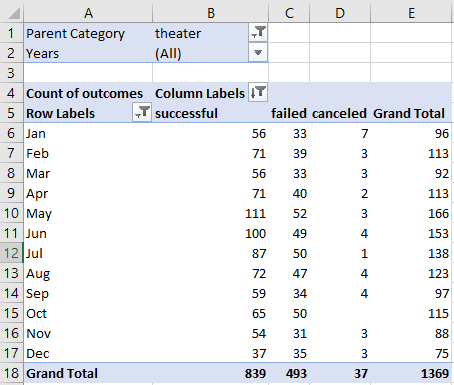
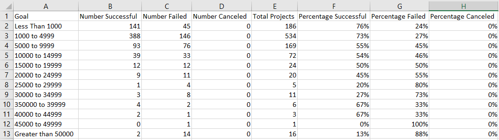
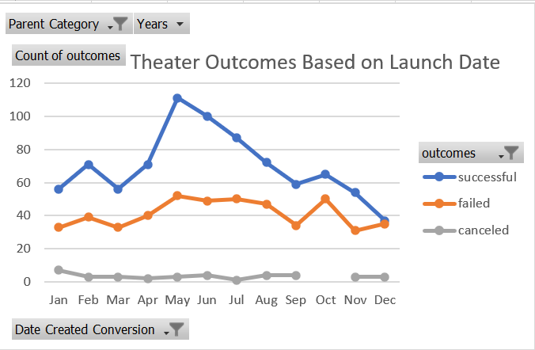
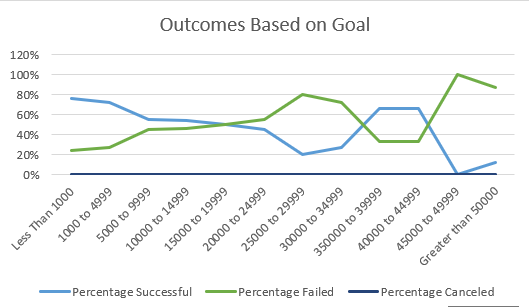

# An Analysis of Kickstarter Campaigns

## Overview of Project
The following project is an analysis of fundraiser data using the Excel program. The project includes three major devilerables. An analysis of outcomes based on launch date (included in Excel doc), which primarily used pivot tables. An analysis of outcomes based on goals (also in Excel doc), which utilized various functions, such as COUNTIFS(). The third devilable is the written explanation contained in this readme.

### Purpose
Louise came close to reaching her fundraising goal for her play, Fever, in a relatively short period of time. Now, she's interested in learning how other fundraising campaigns fared in relation to launch date and fundraising goals. The purpose of this project is to carry out an analysis of various other fundraising campaigns, in order to provide insight to Louise.

## Analysis and Challenges
The following is an an analysis of the two deliverables, and a discussion of the challenges I faced in completing this project.

### Deliverable 1: Analysis of Outcomes Based on Launch Date

In order to meet address deliverable 1, a pivot table was created in a new worksheet labeled, using the kickstarter data set. Pivot table filters were set to "Parent Category" and "Years." Next, the "Parent Category" was filtered on "theater." The campaign outcomes were sorted in descending order. See the excel sheet below. Finally, the data was visualized in a line graph, displayed in results below.

### Excel Sheet: Pivot Table

### Deliverable 2: Analysis of Outcomes Based on Goals

In deliverable two, a new function, (COUNTIFS()), was used to collect the outcome and goal data for the “plays” subcategory. 

The following columns were created to hold the data:
-Goal
-Number Successful
-Number Failed
-Number Canceled
-Total Projects
-Percentage Successful
-Percentage Failed
-Percentage Canceled

In the "Goal" column, dollar amount ranges were created to categorize goal amount into groups (see excel sheet below). The COUNTIFS() function was used to count the number of campaigns in each category. For example, the follow code was used for Successful campaigns whose goal was between $1,0000 and $4,9999.

- =COUNTIFS(Kickstarter!$D:$D,">=1000",Kickstarter!$F:$F, "Successful", Kickstarter!$D:$D,"<=4999")

### Excel Sheet: Outcomes vs Goals

### Challenges and Difficulties Encountered

## Results
The following are results drawn from Deliverable one (Outcomes vs Launch Date) and Deliverable two (Outcomes based on Goals).

#### Conclusions you can draw about the Outcomes based on Launch Date?

### Line Chart Outcomes vs Launch Date

### Conclusions based on Outcomes based on Goals?

The success and failure of a goal are inversely correlated. Campaigns which had a lower goal were more likely to succeed. More than 70% of campaigns with goals under $5,000 succeeded. On the other hand, the higher the goal, the more likely the campaign was to fail. Those with goals of $45,000 or more, failed nearly at a rate of nearly 90%. None of these campaigns were canceled.

### Line Chart Outcomes vs Goals

- What are some limitations of this dataset?

- What are some other possible tables and/or graphs that we could create?
There is a summary of the limitations of the dataset, and there is a recommendation for additional tables or graphs.
